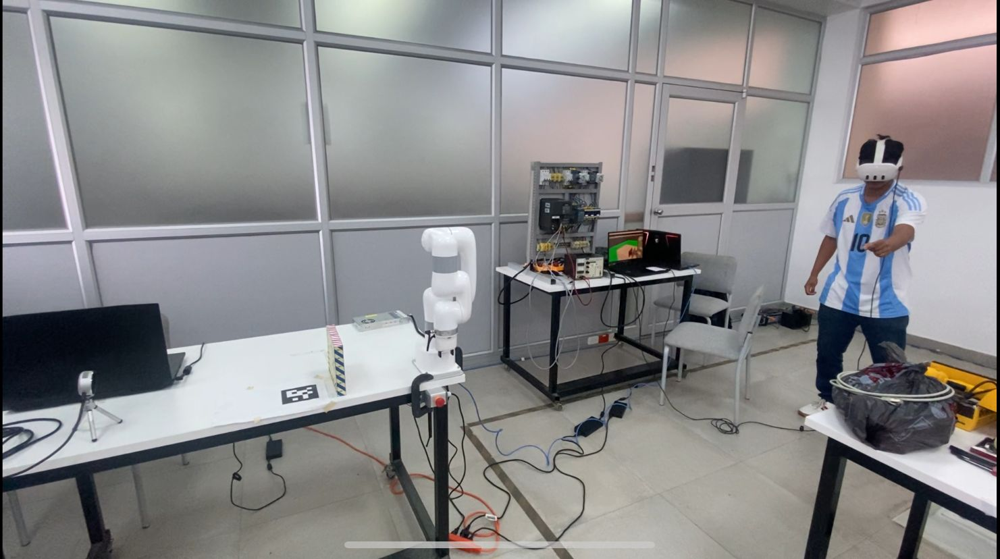

# Sistema de Teleoperación usando RV con ROS2

<p align="center">
  
</p>


Sistema ROS 2 desarrollado para un proyecto de **teleoperación robótica mediante realidad virtual**, integrando percepción 6-DoF, planificación de movimientos y control de un manipulador desde Unity.

---
## Tabla de Contenidos

- [Características del sistema](#características-del-sistema)
- [Paquetes oficiales](#paquetes-oficiales)
- [Contribuciones del proyecto](#contribuciones-del-proyecto)
- [Configuración inicial del sistema](#configuración-inicial-del-sistema)
  - [Requisitos del entorno](#requisitos-del-entorno)
  - [Preparación del workspace](#preparación-del-workspace)
  - [Variables de entorno](#variables-de-entorno)
- [Modos de operación del sistema](#modos-de-operación-del-sistema)
  - [Modo simulado](#modo-simulado)
  - [Modo robot real](#modo-robot-real)
- [Integración del sistema de percepción](#integración-del-sistema-de-percepción)
  - [Publicación de la pose en ROS 2](#publicación-de-la-pose-en-ros-2)
  - [Corrección de orientación del frame de la cámara](#corrección-de-orientación-del-frame-de-la-cámara)
  - [Visualización del mesh de la cámara en RViz](#visualización-del-mesh-de-la-cámara-en-rviz)
  - [Visualización del objeto detectado](#visualización-del-objeto-detectado)
- [Planificación de movimientos y grasping](#planificación-de-movimientos-y-grasping)
  - [Inicialización del pipeline de grasping](#inicialización-del-pipeline-de-grasping)
  - [Planificación de trayectorias con MoveIt](#planificación-de-trayectorias-con-moveit)
  - [Definición de la pose final mediante ghost marker](#definición-de-la-pose-final-mediante-ghost-marker)
- [Notas adicionales](#notas-adicionales)

---

## Características del sistema

- Comunicación bidireccional entre ROS 2 y Unity mediante ROS-TCP.
- Integración con el manipulador xArm Lite 6, tanto en modo simulado como en robot real.
- Publicación y corrección de poses 6-DoF provenientes de sistemas de visión.
- Generación y gestión de transformaciones TF dinámicas y estáticas.
- Control independiente del gripper, desacoplado del control del brazo.
- Compatibilidad con el framework de planificación MoveIt 2.
- Arquitectura modular y extensible, orientada a la integración de nuevos sensores y dispositivos.


---

## Paquetes oficiales

### ROS-TCP-Endpoint
Paquete oficial utilizado como puente de comunicación entre Unity y ROS 2.  
Permite la transmisión de poses, estados y comandos desde el entorno de realidad virtual hacia el sistema ROS.

- Repositorio oficial: https://github.com/Unity-Technologies/ROS-TCP-Endpoint
- Función principal: comunicación ROS 2 ↔ Unity
- Estado en el proyecto: integrado sin modificaciones internas

---

### xarm_ros2
Paquete oficial desarrollado por UFactory para el control del manipulador xArm Lite 6.

Incluye los elementos necesarios para la operación del robot, tanto en simulación como en robot real.

- Repositorio oficial: https://github.com/xArm-Developer/xarm_ros2
- Componentes principales:
  - Descripción del robot (URDF)
  - Integración con ros2_control
  - Configuración para MoveIt 2
- Estado en el proyecto: utilizado como base del sistema, sin modificaciones estructurales


## Contribuciones del proyecto

### foundation_pose_tf
Paquete desarrollado en este proyecto para el procesamiento y transformación de poses 6-DoF provenientes de sistemas de visión.

Su función principal es adaptar las poses detectadas a marcos de referencia compatibles con ROS y con los módulos de planificación de movimiento.

Funciones principales:
- Conversión de mensajes **PoseStamped** a transformaciones TF válidas.
- Corrección y alineación de marcos de referencia.
- Publicación de marcadores de visualización para RViz.
- Integración directa con el pipeline de planificación de agarre (grasp planning).

Ejemplo de ejecución:
```
ros2 run foundation_pose_tf pose_to_tf
```
### gripper_description
Paquete desarrollado en este proyecto que contiene la descripción del efector final utilizada por el sistema.

Incluye:
- Modelos de malla (meshes) de la base del gripper.
- Modelos de malla del dedo izquierdo y del dedo derecho.
- Configuración cinemática del gripper integrada al URDF base del robot.

Este paquete permite visualizar el gripper correctamente ensamblado junto al manipulador en RViz, facilitando la simulación, la validación del modelo completo del sistema robótico y su uso en planificación de movimiento.

---

### gripper_control
Paquete desarrollado en este proyecto encargado de la lógica de control del gripper.

Permite la apertura y el cierre del gripper de manera coherente en distintos entornos de ejecución.

Funciones principales:
- Control del gripper en simulación mediante RViz.
- Control del gripper en el robot real.
- Control del gripper desde Unity mediante mensajes JSON enviados a través del servidor web proporcionado por el fabricante del robot.
- Sincronización del estado del gripper entre ROS, Unity y el sistema físico.

Este paquete desacopla el control del gripper del control del brazo, facilitando su integración en flujos de Pick and Place y en esquemas de teleoperación.


## Configuración inicial del sistema

### Requisitos del entorno

Para utilizar el sistema de teleoperación basado en ROS 2 es necesario contar con el siguiente entorno mínimo:

- Sistema operativo Linux compatible con ROS 2 Humble (por ejemplo, Ubuntu 22.04).
- ROS 2 Humble correctamente instalado y configurado.
- Conectividad de red entre los equipos involucrados (sistema de visión, sistema de control y Unity).
- Acceso al repositorio del proyecto.

---

### Preparación del workspace

El sistema ROS 2 se encuentra contenido dentro del repositorio del proyecto y debe ser compilado como un workspace estándar de ROS 2.

Primero, se debe clonar el repositorio del proyecto:
```
git clone https://github.com/VictorFelipeZunigaQuesada/VR---Robot---Teleoperation.git
```
Una vez clonado el repositorio, se debe acceder al directorio correspondiente al sistema ROS 2 y compilar el workspace:
```
cd VR---Robot---Teleoperation/ros2_system
```
```
colcon build
```

Este proceso generará los archivos necesarios para la correcta ejecución de los nodos del sistema.

---

### Variables de entorno

Antes de ejecutar cualquier nodo del sistema, es necesario cargar el entorno de ROS 2 y el entorno del workspace compilado.

Para evitar ejecutar estos comandos manualmente en cada nueva terminal, se recomienda agregarlos al archivo `~/.bashrc` del usuario.

Las siguientes líneas deben añadirse al final del archivo `~/.bashrc`:
```
source /opt/ros/humble/setup.bash
source ~/VR---Robot---Teleoperation/ros2_system/install/setup.bash
```

## Modos de operación del sistema

El sistema de teleoperación puede utilizarse en dos modos distintos: simulación y robot real.  
Ambos modos utilizan MoveIt como framework de planificación, pero difieren en la forma en que se ejecuta el control del manipulador y del gripper.

---

### Modo simulado

En modo simulado, el sistema utiliza el entorno de MoveIt con controladores falsos (fake controllers), lo que permite probar la planificación de movimientos y la integración del gripper sin necesidad de un robot físico.

Para iniciar el sistema en modo simulado, se debe ejecutar el siguiente comando:
```
ros2 launch xarm_moveit_config lite6_moveit_fake.launch.py add_gripper:=true
```

Este modo es útil para pruebas de planificación, validación del modelo cinemático y desarrollo del pipeline de control sin riesgo para el hardware.

---

### Modo robot real

En modo robot real, el sistema se conecta físicamente al manipulador xArm Lite 6 y requiere la ejecución de dos procesos en terminales separadas.

En la primera terminal (Terminal A), se debe lanzar MoveIt configurado para control real del robot:
```
ros2 launch xarm_moveit_config lite6_moveit_realmove.launch.py robot_ip:=200.126.19.206 add_gripper:=true
```

En la segunda terminal (Terminal B), se debe ejecutar el nodo de control del gripper:
```
ros2 run gripper_control lite6_gripper_ws
```

Este modo permite la ejecución completa del sistema sobre el robot físico, integrando planificación de movimiento, control del gripper y sincronización con el entorno de teleoperación.

## Integración del sistema de percepción

El sistema de teleoperación recibe información de percepción proveniente del sistema de visión, la cual es utilizada para definir la posición y orientación de la cámara y de los objetos dentro del entorno de Unity.

El sistema de visión proporciona estimaciones de pose 6-DoF, compuestas por una posición tridimensional y una orientación expresada en forma de cuaternión.

Los datos de percepción se reciben con el siguiente formato general:
```
POS: [x y z] | QUAT: [qx qy qz qw]
```

Donde:
- `POS` representa la posición del objeto o referencia en el espacio tridimensional.
- `QUAT` representa la orientación en forma de cuaternión.

A continuación se muestra un ejemplo real de los datos entregados por el sistema de visión:
```
POS: [-0.00343562 -0.9274355 0.14203226] | QUAT: [ 0.73741093 0.02974693 -0.0271272 -0.67424354]
```

Esta información es utilizada en Moveit para:
- Colocar la cámara virtual en una posición coherente con el entorno real.
- Alinear correctamente la orientación de la cámara u objetos virtuales.
- Mantener consistencia espacial entre el sistema de visión, el entorno virtual y el sistema ROS 2.

La correcta interpretación de estos datos es fundamental para asegurar la coherencia entre la percepción, la visualización en realidad virtual y la planificación de movimientos del manipulador.


---

### Publicación de la pose en ROS 2

A partir de estos datos, la pose estimada por el sistema de visión se publica en ROS 2 como una transformación estática utilizando `static_transform_publisher`.

La traslación (`POS`) se utiliza directamente sin modificaciones, mientras que la orientación (`QUAT`) requiere un reordenamiento de componentes y un ajuste de signos para ser compatible con el sistema de referencia utilizado en ROS 2.

La publicación de la transformación se realiza en una nueva terminal mediante el siguiente comando:

```
ros2 run tf2_ros static_transform_publisher 
  --x -0.00343562 --y -0.9274355 --z 0.14203226 
  --qx 0.02974693 --qy -0.73741093 --qz -0.67424354 --qw 0.0271272 
  --frame-id link_base --child-frame-id camera_link
```

En este proceso:
- La traslación se mantiene idéntica a la entregada por el sistema de visión.
- Los componentes del cuaternión se publican de forma intercalada.
- Se aplica un cambio de signo en algunos componentes del cuaternión para garantizar una orientación coherente dentro del sistema de coordenadas de ROS 2.

Esta transformación define el frame `camera_link` con respecto al frame `link_base`, permitiendo que el resto del sistema ROS 2 utilice la información de percepción de forma consistente.

La correcta publicación y alineación de esta transformación es fundamental para asegurar la coherencia entre la percepción y la planificación de movimientos del manipulador.


En este proceso:
- La traslación se mantiene idéntica a la entregada por el sistema de visión.
- Los componentes del cuaternión se publican de forma intercalada.
- Se aplica un cambio de signo en algunos componentes del cuaternión para garantizar una orientación coherente dentro del sistema de coordenadas de ROS 2.

Esta transformación define el frame `camera_link` con respecto al frame `link_base`, permitiendo que el resto del sistema ROS 2 utilice la información de percepción de forma consistente.

---

### Corrección de orientación del frame de la cámara

Luego de publicar la transformación anterior, el frame de la visión y el mesh de la cámara presentan una orientación invertida.  
Por este motivo, es necesario definir una transformación adicional que alinee correctamente el frame óptico de la cámara.

Esta corrección se realiza publicando una transformación estática adicional entre `camera_link` y `camera_optical_frame`, aplicando una rotación de 180 grados alrededor del eje X:
```
ros2 run tf2_ros static_transform_publisher 0 0 0 3.1416 0 0 camera_link camera_optical_frame
```

Esta transformación permite que la orientación del frame óptico de la cámara sea coherente con las convenciones utilizadas en ROS.

---

### Visualización del mesh de la cámara en RViz

Para visualizar el modelo de la cámara dentro de RViz, es necesario publicar un marcador asociado a su mesh.

Esto se realiza ejecutando el siguiente nodo:
```
ros2 run foundation_pose_tf camera_marker
```

Posteriormente, en RViz se debe añadir un panel de tipo **Marker** y seleccionar el tópico correspondiente para poder visualizar correctamente el modelo de la cámara.

---

### Visualización del objeto detectado

De forma similar, para visualizar el objeto detectado por el sistema de percepción, se debe ejecutar el siguiente comando:
```
ros2 run foundation_pose_tf model2_marker
```

Luego, en RViz se debe añadir un panel de tipo **Marker** y seleccionar el tópico `visualization_marker` para observar el modelo del objeto en el entorno.

La correcta publicación de estos marcadores permite validar visualmente la coherencia entre la percepción, los frames de referencia y el entorno de planificación del sistema ROS 2.

## Planificación de movimientos y grasping

Una vez que la información de percepción ha sido correctamente publicada y validada en el sistema ROS 2, se procede a la etapa de planificación de movimientos y generación de grasps.

La planificación se basa en un pipeline compuesto por tres procesos principales, los cuales deben ejecutarse en el orden descrito a continuación.

---

### Inicialización del pipeline de grasping

El primer paso consiste en lanzar el pipeline de grasping, el cual se encarga de preparar el entorno de planificación y de analizar las posibles configuraciones de agarre del objeto.

Este proceso se inicia mediante el siguiente comando:
```
ros2 launch foundation_pose_tf grasp_pipeline.launch.py
```

Este nodo cumple múltiples funciones dentro del sistema:

- Carga la escena de planificación en MoveIt, incluyendo objetos de colisión como la mesa y la cámara.
- Inicializa los nodos necesarios para el análisis de grasping.
- Obtiene las dimensiones del objeto detectado a partir de su modelo y construye su bounding box.
- Considera las dimensiones y limitaciones físicas del gripper del robot.
- Identifica la cara del objeto que se encuentra en contacto con la mesa.
- Filtra las posibles configuraciones de grasp de acuerdo con la pose inicial y la pose final del objeto.
- Genera candidatos de grasp tomando siempre como referencia el centro geométrico de la cara válida del objeto.

El resultado de este proceso es un conjunto de posibles grasps válidos que pueden ser utilizados durante la planificación de trayectorias.

---

### Planificación de trayectorias con MoveIt

Una vez inicializado el pipeline de grasping, se ejecuta el nodo encargado de la planificación de trayectorias utilizando los servicios de MoveIt.

Este proceso se inicia con el siguiente comando:
```
ros2 run foundation_pose_tf grasp_plan_only_selector
```


Este nodo utiliza la información generada previamente por el pipeline de grasping para:

- Solicitar a MoveIt la planificación de trayectorias para cada grasp candidato.
- Ejecutar primero la fase de planificación.
- Verificar si la planificación fue exitosa.
- En caso de éxito, ejecutar la trayectoria planificada.
- En caso de fallo, iterar automáticamente sobre la siguiente configuración de grasp disponible.

Este mecanismo permite seleccionar de forma automática una trayectoria válida sin intervención manual, siempre que exista al menos una solución alcanzable.

---

### Definición de la pose final mediante ghost marker

El último componente del proceso de planificación corresponde a la definición de la pose final deseada del objeto.

Este paso se realiza ejecutando el siguiente nodo:
```
ros2 run foundation_pose_tf ghost_marker
```

Este nodo permanece a la espera de la pose final definida por el usuario desde el sistema de teleoperación.  
Una vez recibida, la pose es publicada en el entorno ROS 2 como un marcador visual (ghost), permitiendo:

- Visualizar la pose final objetivo del objeto.
- Utilizar dicha pose como referencia para la planificación de la fase final del movimiento.

Con la información de la pose inicial, la pose final y los grasps válidos generados, el sistema inicia el proceso completo de planificación de movimientos del manipulador.

## Notas adicionales

### Configuración de red (Cyclone DDS)

El sistema ROS 2 utiliza Cyclone DDS como middleware de comunicación.  
Para permitir la correcta transmisión de datos entre distintos equipos (por ejemplo, el equipo de visión y el equipo de control/teleoperación), es necesario configurar adecuadamente la interfaz de red en el archivo `cyclonedds.xml`.

Cada usuario debe identificar la dirección IP de su propio equipo utilizando el siguiente comando:

```
hostname -I
```